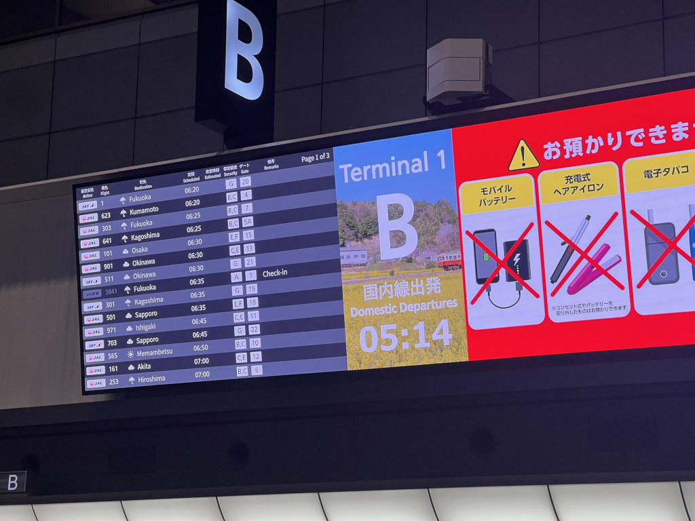
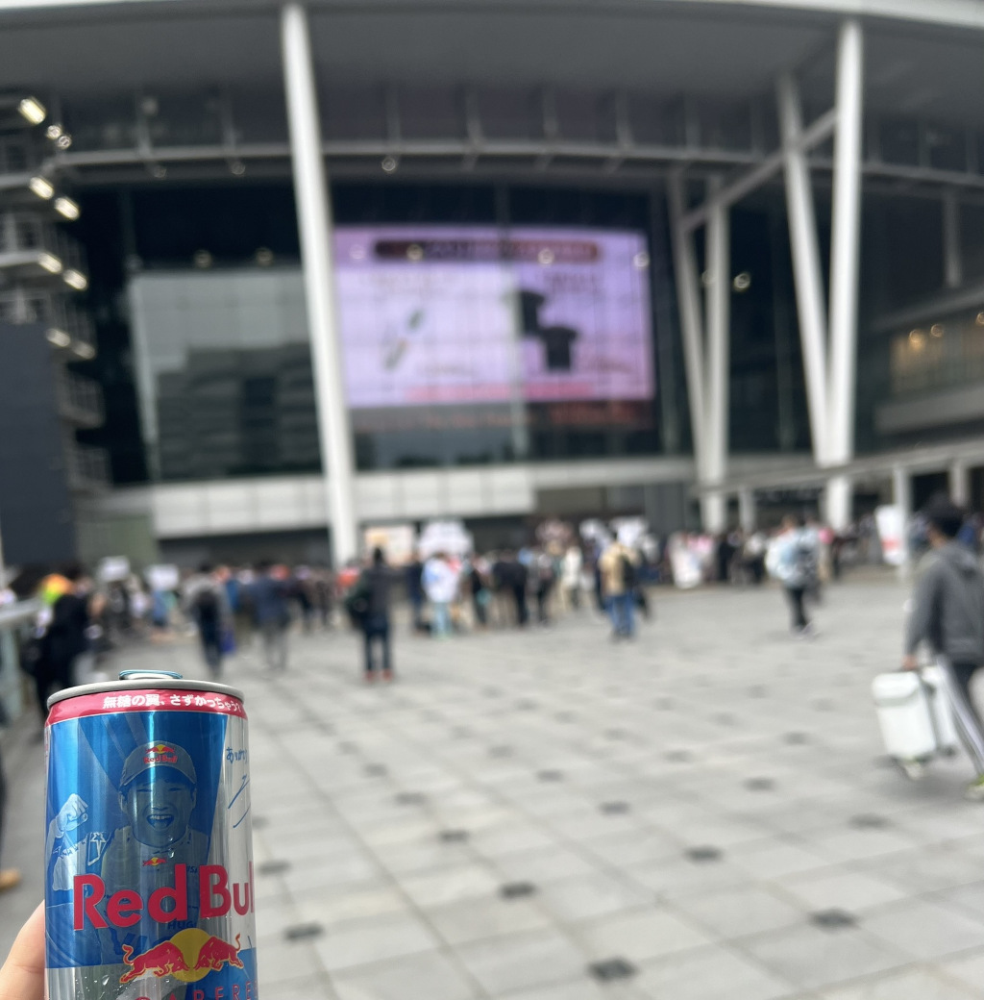

今日は早朝に諸用のため羽田空港までマイカーで向かった。

羽田空港に車で訪れるのは初めてで、空港到着後に駐車場へ入るまでの道のりがややこしく、道を間違えるとそのまま首都高速に放り込まれそうな緊張感があった。

無事に送り届けて帰宅したあとは、睡眠不足を補うために仮眠を取ったつもりが、気づけば正午を回っていた。目覚めたときには仕事に大遅刻したかと思い、冷や汗をかいた。

その後、ウマ娘のイベントに参加するため準備を整え、15時過ぎに家を出発。

会場はウマ娘単独としては初のさいたまスーパーアリーナ。入場列を甘く見ていたことを少し後悔するほどの人出だった。とはいえ、この熱気もライブ当日ならではの高揚感の一部なのかもしれない。

座席を確認した際はアリーナ席でない200レベルだったため落胆したが、実際に入場してみるとステージは想像以上に大きく、アリーナ席の数も限られていたため納得がいった。しかもステージの高さもそこそこあり、むしろ200レベルの方が視線が合いやすく、演者を見やすい良席だったのかもしれないと感じた。

開演後、実際に座ってみると席はセンターステージの事実上の正面。しかもグッズでも大きくフィーチャーされていたアーモンドアイ役の石原夏織さんが目の前にいる位置だった。かつてはライブはもういいかなと思っていた自分が、突発的にチケットを申し込んだ理由の一つが彼女の出演だったので、まさに願ったり叶ったりの状況。**無敵だった。**

トリプルティアラのゾーンでは、メジロラモーヌからスティルインラブへと続き、世代順なら次はジェンティルドンナかと思い構えていた。予想通り『LADY G DONNA』が始まったが、やはりスクワットのイメージが浮かび、演者がMCでその話題に触れた時には苦笑を禁じ得なかった。

次は世代的にはアーモンドアイだと身構えていて、アーモンドアイとデアリングタクトが並んでステージに立ったとき、最初は曲やタイムテーブルの都合でまとめられたのかと思い、少し肩を落とした。けれど、すぐに「これは2020年のジャパンカップだ」と気づき、「あと一人この場にいてほしい……！」と心の中で叫んでいた。掛け合いや演出を通じて実際の当時のレースがまざまざと蘇り、涙腺が刺激された。演出としては石原さんの背中越しに羊宮さんの顔が見えるような構図のカメラワークが印象的だった。

その次に始まったのは『シンデレラグレイ』ゾーン。漫画のカットがディスプレイに映し出されて感傷に浸っていたところ、北原が「君、名前は!?」と尋ねた瞬間、映像がアニメシーンに切り替わり、舞台上で高柳さんが「……オグリキャップ」と名乗る場面へ。その瞬間にこみ上げるものがあり、『超える』のカバーが流れ始めた頃には、もう涙を止めることができなかった。

まさかここで『カサマツ音頭』が流れるのではと一瞬身構えたが、セットリストは王道で、『BRIGHTEST HEART』がかかり安心して鑑賞できた。ベルノライト役・瀬戸桃子さんのサプライズ登場には驚かされたが、感情がすでに大きく揺さぶられた後だったため、比較的冷静に受け止められた。

全体として、今回はトリプルティアラに強く焦点を当てた構成だったという印象を受けた。ただ、それならばオークス開催日にライブをぶつけないでほしかったという気持ちも否めない。
