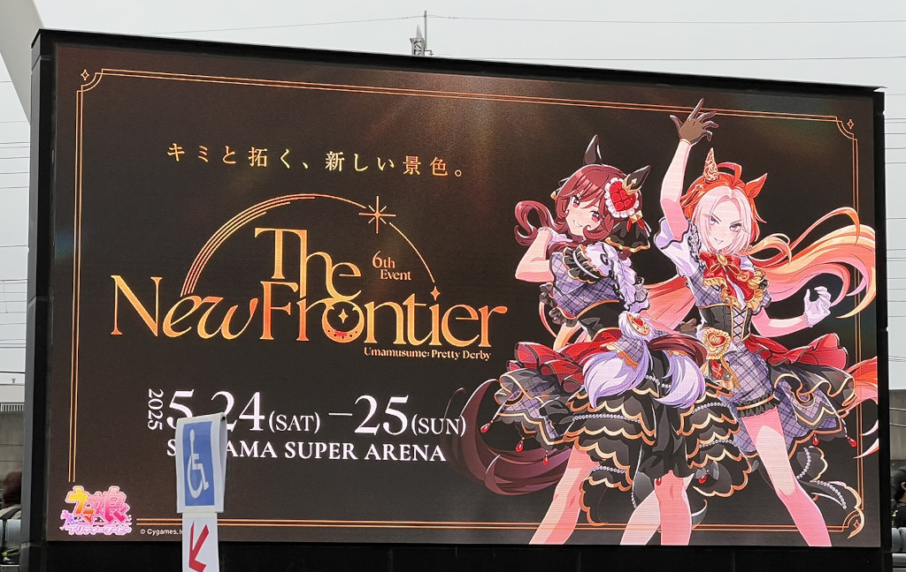

今日は昨日に引き続き、ウマ娘のイベントに参加した。

座席は200レベルの3列目で、ステージを真上から見たとき12時方向が正面だとすると9時方向にあたる位置だった。正面ではないものの、サブステージやステージ側面でのパフォーマンスがよく見え、距離感としては満足のいくものだった。

3曲目『立ち位置ゼロ番！順位は一番！』では、本来の持ちキャラであるスマートファルコンが不在で、参加メンバーのつながりもすぐには見えてこなかったが、サブステージでパフォーマンスするアーモンドアイ役・石原さんの姿がよく見えたので、個人的には十分満足だった。

昨日の段階から感じていたことだが、今回のイベントはこれまでのライブと比べてセットリストの組み方や演出の工夫が格段に洗練されていた。ファンの期待を裏切らず、それでいてただのリリースイベントに終わらない、構成の妙が光っていた。

たとえば、『ソシテミンナノ』は、G1で幾度も苦杯をなめながら挑戦を続けたヴィルシーナ、ウインバリアシオン、ラッキーライラック、カレンブーケドールらの歌唱で披露され、冒頭で繰り返される「勝ちたい」やサビ前の「負けない」といった歌詞に、彼女たちの歩んだ道の重みが乗っていて、胸に響いた。

MCの中で「今日は何の日？」と問われ、「香坂さんと望月さんの誕生日」が正解だったにもかかわらず、「オークス！」と元気よく叫んでしまった自分を含め、同じような反応をした人が少なくなかったのは少しだけ恥ずかしく、ちょっとした苦い思い出だ。

前日とメンバーが異なり、『L'Arc de gloire』が凱旋門賞組のみで披露された際、オルフェーヴルの姿がなく「凱旋門賞エアプか？」と内心思ったものの、その後の『Ms. VICTORIA』でジェンティルドンナとオルフェーヴルによる2012年ジャパンカップを想起させる演出が登場し、一気に納得。さすがの構成に思わず膝を打った。昨日はアーモンドアイ役・石原さんとデアリングタクト役・羊宮さんが向かい合ってバチバチやっていたが、今日のジェンティルドンナ役・芹沢さんとオルフェーヴル役・日笠さんはステージ中央で全く視線を交わさなかったところが印象的だった。

そのオルフェーヴルのソロ曲『以下、勅命』では、椅子と共に日笠さんがセンターに登場し、そのインパクトに思わず笑ってしまった。先にソロを披露していたドリームジャーニー役・吉岡さんが椅子の横に立ち、ビジュアル再現をしていたのも印象的だった。バックダンサーが王に跪くように隊列を組む演出も見事で、最後の「貴様ら、頭が高い」の一言には、自然と頭を下げたくなるほどの威厳が宿っていた。

『Everlasting BEATS』では、ステイゴールド産駒たち――ゴールドシップ、ナカヤマフェスタ、オルフェーヴル、ドリームジャーニー、フェノーメノ――が一堂に会してのパフォーマンスだった。血統のつながりを象徴するグランドマスターズシナリオのテーマだからこそ、このメンバーでの歌唱には特別な重みがあった。2番からでもいいからステイゴールド本人がサプライズで登場してくれないかと淡い期待を抱いていたところ、曲の終わりに「それは長い旅路にも似て―」のメッセージがスクリーンに映し出され、周囲の空気が一気に変わった。「運命は今、根源へと至る」と続いたところで確信し、ペンライトを黄色に変更。最後に「ステイゴールド」の名前が表示された瞬間、あちこちから歓声が上がり、私も思わず「アネゴ～！」と叫んでいた。ずっと待っていたウマ娘だっただけに、その登場は本当に嬉しく、イベント全体の中でも最もインパクトの強い瞬間だった。むしろ、もっと後のブロックでも良かったのではとすら感じた。

シンデレラグレイゾーンでは、『超える』のカバーがオグリキャップ役・高柳さんとタマモクロス役・大空さんによってフルで歌唱され、今後のアニメ展開への期待も自然と高まった。

続くMCではメッセージがあるという前振りがあり、トレーナー役・小西さんの登場かと予想していたら、なんと『超える』の原曲アーティスト\[Alexandros\]からの撮りたてホヤホヤのメッセージだった。その後、高柳さんが川上さんに「この曲をどう歌えばよいですか」と尋ねた際に「その時はこの曲はもうあなたのものだから、そのように歌えば良い」と答えられたと紹介し、作品や楽曲への愛情が深く感じられた。

アーモンドアイのソロ曲『Glory Eyes』もまた、非常に印象深かった。言葉でうまく表現できないほど良く、ステージを一周しながらバックダンサーを引き連れて歌うその姿には、まさにアイドルとしての魅力が凝縮されていた。可愛さと存在感が両立した演出だった。

『Precious Star Dreamer』は、2018年および2019年のクラシック世代によるパフォーマンスで、この世代が好きな私にとってはたまらない一曲だった。中でもアーモンドアイ、グランアレグリア、ラヴズオンリーユー、クロノジェネシスの4頭は特に思い入れがあり、その気持ちをあらためて実感した。

『winning the soul』の後には、新曲『AmpReFire』が初披露された。昨日の『黎明に咲く華』がトリプルティアラを象徴する楽曲だとするならば、この曲はクラシック三冠をイメージした熱い楽曲で、winning the soulからの流れも含めて「新しい時代の始まり」を感じさせる構成だった。

アンコール後、『うまぴょい伝説』の後にキャストが退場する際、昨日はジェンティルドンナ役・芹沢さんが挨拶を務めていたが、今日はオルフェーヴル役・日笠さんが担当。イベントのキービジュアルに登場している二人であることを思えば、順当な流れだった。日笠さんの挨拶では、王からのお褒めの言葉のようなものがあるかと構えていたところ、最後に「貴様ら、頭が高い」と高らかに言い放たれ、会場全体が「ははーっ！」とロールプレイで頭を下げるという、完璧すぎる締めくくりとなった。心から楽しいと思える瞬間だった。
